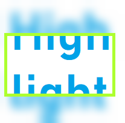

# Highlight-Me

Highlight-Me is a tool that enables users to highlight areas of screenshots or images 🖼️.

To use this tool, click on "Load" 🔽 to load the screenshot or image from the clipboard into the program.

After loading, the screenshot or image will be blurred 🔀. Depending on your CPU and RAM, this may take a few seconds ⏳.

You can then highlight areas of interest by dragging and dropping ☟📱 over the area you want to highlight. The highlighted area will become clear again 🏴󠁣󠁯󠁭󠁡󠁧󠁿.

Once you're done, click on "Save" 💾 to put the highlighted image back into the clipboard. Enjoy using Highlight Me! 🎉